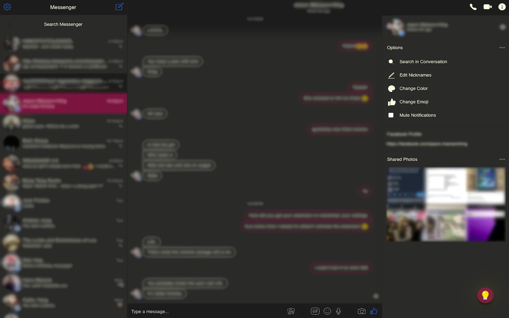

# darkn
Chrome extension to darkn Facebook Messenger



## Good to Knows
+ ES6
+ Gulp
+ Sass

## Setting Up
Clone the repo and install the packages.
```
$ git clone git@github.com:andrewjungg/darkn.git
$ npm i
```

## Gulp Tasks
Run ```gulp``` to minify and watch.
```
$ gulp
```

Run ```gulp build``` to just minify.
```
$ gulp build
```

Run ```gulp watch``` to just watch.
```
$ gulp watch
```

## Want to Add Features? Contribute Please
1. Create a new branch ```git checkout -b YOUR-NEW-BRANCH```
2. Add your changes ```git add CHANGED-FILES``` or ```git add -A```
3. Commit your changes ```git commit -m 'Added YOUR NEW FEATURE'```
4. Push your branch ```git push -u origin YOUR-NEW-BRANCH```
5. Send me a pull request

## Bugs and Issues?
Feel free to open up an issue and I'll try to fix it ASAP. Or if you think you know the fix please feel free to create a branch and send a pull request!

## Special Thanks
+ [@ifalluphill](https://github.com/iFallUpHill) for help with the script
+ [@jackforbes](https://github.com/JackForbes) for the icon
